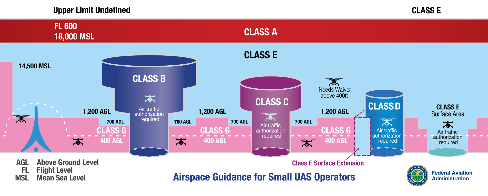
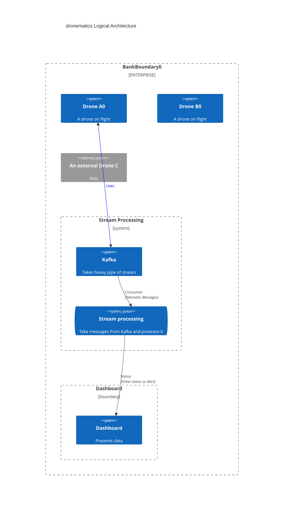

# dronematics

### Monitor drones in real time
- Health
- Flying in authorized fly zone outside of class B , C  and D 

### Tasks 
- [ ] Build Drone data gen simulator
  - [Take Data open data set from this link](https://www.kaggle.com/datasets/kmader/drone-videos?resource=download&select=DJI_0501.SRT)  
  - [To analyze above dataset](https://djitelemetryoverlay.com/srt-viewer/)
- [ ] Kafka
  - [ ] Configure Kafka topic
- [ ] PySpark
  - [ ] Configure pyspark to consume messages
- [ ] Build basic Dash board to work  

### Logical Architecture

